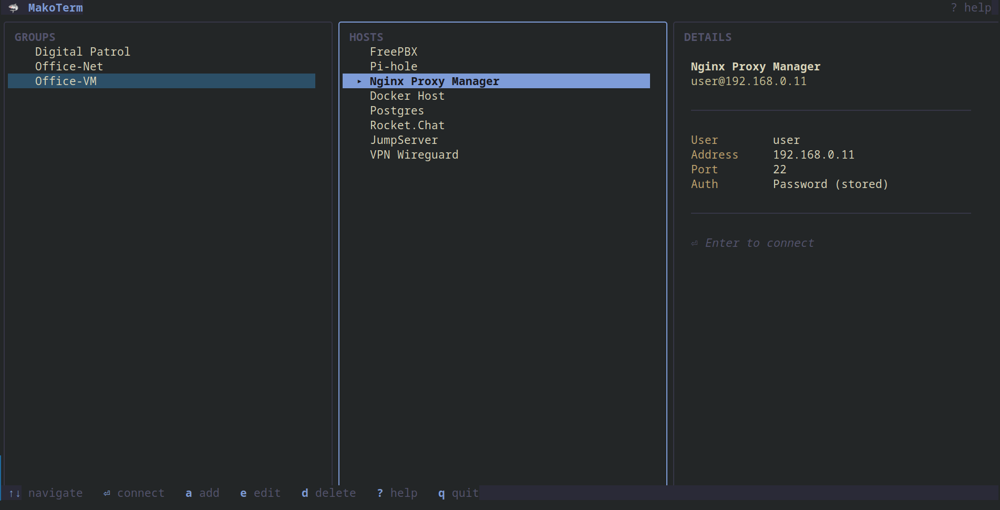

# MakoTerm 🦈

TUI SSH-клиент, написанный на Go с использованием фреймворка [Bubble Tea](https://github.com/charmbracelet/bubbletea). Управление SSH-подключениями через интерфейс Miller Columns с локальным хранением данных в SQLite.

## Возможности

- **Нативный SSH-клиент** — работает через `golang.org/x/crypto/ssh`, без зависимости от внешнего `ssh`
- **Навигация Miller Columns** — три колонки: группы → хосты → детали
- **SSH Agent / ключи / пароли** — автоматический перебор методов аутентификации
- **Ключи с парольной фразой** — запрос парольной фразы вместо молчаливого отказа
- **Верификация host key** — проверка через `~/.ssh/known_hosts` с интерактивным TOFU-промптом
- **Поддержка legacy-оборудования** — включены устаревшие шифры для совместимости (Cisco, старые серверы)
- **Keepalive** — сессия не «умирает» за NAT и на idle-файрволах
- **Локальная база данных** — SQLite (`~/.makoterm.db`), права доступа 0600
- **Физическое удаление секретов** — удалённые хосты и группы исчезают из файла БД вместе с паролями
- **CRUD** — создание, редактирование, удаление групп и хостов из TUI
- **Сохранение состояния UI** — при возврате из SSH-сессии позиция курсора сохраняется
- **Help-экран** — клавиша `?` для просмотра горячих клавиш
- **Тема Kanagawa** — тёмная цветовая схема с продуманной иерархией

## Скриншот



## Требования

- Go 1.24 или новее (минимальная версия указана в `go.mod`)
- C компилятор (GCC или Clang) — необходим для CGO-зависимости SQLite
- Терминал с поддержкой UTF-8 и 256 цветов

### macOS

```bash
xcode-select --install   # если Xcode CLI Tools не установлены
```

### Linux (Debian/Ubuntu)

```bash
sudo apt install gcc
```

## Установка

```bash
git clone https://github.com/usov-ap/makoterm3.git
cd makoterm3
go mod download
go build -o makoterm
```

## Запуск

```bash
./makoterm
```

CLI-аргументов нет. При первом запуске автоматически создаётся база `~/.makoterm.db` с демонстрационными данными.

### Переменные окружения

| Переменная | Значение | Описание |
|------------|----------|----------|
| `MAKOTERM_NO_DEMO` | любое непустое | Не создавать демонстрационные группы и хосты при первом запуске |
| `MAKOTERM_DEBUG` | путь к файлу или `1` | Писать отладочные логи SSH в указанный файл (`1` → `~/.makoterm.log`) |
| `SSH_AUTH_SOCK` | путь к сокету | Стандартная переменная ssh-agent; используется для аутентификации |

## Быстрый старт

1. Запустите `./makoterm`
2. Вы увидите три колонки: **GROUPS** → **HOSTS** → **DETAILS**
3. Нажмите `→` для перехода в колонку хостов
4. Нажмите `a` для добавления нового хоста
5. Заполните поля: Name, Address, Port, User, Password/Key Path
6. Нажмите `Enter` для сохранения
7. Выберите хост и нажмите `Enter` для подключения
8. Для возврата из SSH-сессии введите `exit` или нажмите `Ctrl+D`

## Горячие клавиши

| Клавиша | Действие | Контекст |
|---------|----------|----------|
| `↑` / `k` | Переместить курсор вверх | Навигация |
| `↓` / `j` | Переместить курсор вниз | Навигация |
| `←` / `h` | Перейти в колонку групп | Навигация |
| `→` / `l` | Перейти в колонку хостов | Навигация |
| `Enter` | Подключиться к хосту / войти в колонку хостов | Навигация |
| `a` | Добавить группу или хост | Навигация |
| `e` | Редактировать выбранный элемент | Навигация |
| `d` | Удалить выбранный элемент | Навигация |
| `?` | Показать справку | Навигация |
| `q` / `Ctrl+C` | Выйти из приложения | Навигация |
| `y` | Подтвердить удаление | Подтверждение |
| `n` / `Esc` | Отменить удаление | Подтверждение |
| `Tab` / `↓` | Следующее поле | Форма |
| `Shift+Tab` / `↑` | Предыдущее поле | Форма |
| `Enter` | Сохранить | Форма |
| `Esc` | Отменить | Форма |

## SSH-аутентификация

При подключении методы аутентификации проверяются в следующем порядке:

1. **SSH Agent** — если доступен через `SSH_AUTH_SOCK`
2. **Указанный ключ** — из поля Key Path в настройках хоста
3. **Стандартные ключи** — `~/.ssh/id_ed25519`, `~/.ssh/id_rsa`
4. **Пароль** — из поля Password в настройках хоста
5. **Интерактивный ввод** — если пароль не сохранён, он запрашивается у пользователя

Все ключи передаются серверу за один проход (единый `PublicKeysCallback`), поэтому пустой ssh-agent не мешает попробовать файловые ключи. Если ключ защищён парольной фразой, MakoTerm запросит её.

## Хранение данных

| Файл | Путь | Права | Описание |
|------|------|-------|----------|
| База данных | `~/.makoterm.db` | 0600 | Группы, хосты, пароли |
| WAL-файлы журнала | `~/.makoterm.db-wal`, `-shm` | 0600 | Появляются при записи |
| Known hosts | `~/.ssh/known_hosts` | 0600 | Ключи серверов |
| Отладочный лог | `~/.makoterm.log` | 0600 | Только при `MAKOTERM_DEBUG` |

> **Внимание:** пароли хранятся в базе данных в открытом виде. Файл защищён правами 0600 (чтение/запись только для владельца). Рекомендуется использовать SSH-ключи.

Удаление хоста или группы **физически** удаляет записи (не «мягкое» удаление), а освободившиеся страницы обнуляются (`secure_delete` + `VACUUM`), поэтому удалённые пароли не остаются в файле. Подробности — в [документации по безопасности](docs/security.md).

## Структура проекта

```
makoterm/
├── main.go              — точка входа, цикл Bubble Tea
├── go.mod
├── database/
│   ├── models.go        — модели Group и Host (GORM, без soft delete)
│   ├── db.go            — InitDB, миграции, CRUD
│   ├── settings.go      — служебная таблица key/value
│   └── db_test.go       — 24 теста
├── sshclient/
│   ├── config.go        — Config: пути, ввод/вывод, логирование
│   ├── manager.go       — Connect(), аутентификация, known_hosts, PTY
│   ├── manager_test.go  — 11 тестов (SSH-сервер в процессе теста)
│   └── testdata/        — ключ с парольной фразой для тестов
├── ui/
│   ├── theme.go         — палитра Kanagawa, стили
│   ├── model.go         — Bubble Tea Model, Update(), View()
│   ├── miller.go        — трёхколоночный layout, скроллинг
│   ├── form.go          — формы добавления/редактирования
│   ├── ui_test.go       — 12 тестов форм, навигации и состояний
│   └── layout_test.go   — 9 тестов геометрии и инвариантов рендера
├── scripts/
│   └── go.sh            — запуск go с локальными кэшами (офлайн/песочница)
├── docs/                — документация
└── images/
    └── screenshot.png
```

## Тестирование

```bash
go test ./...            # 56 тестов
go test -race ./...      # проверка на data races
go vet ./...             # статический анализ
staticcheck ./...        # расширенный анализ (необязательно)
```

Тесты `sshclient` поднимают настоящий SSH-сервер в процессе теста, поэтому покрывают TOFU, смену host key и работу с зашифрованными ключами. Проверки запускаются в CI на минимальной поддерживаемой и текущей версиях Go.

## Документация

| Документ | Описание |
|----------|----------|
| [Руководство пользователя](docs/user-guide.md) | Подробное описание интерфейса и работы |
| [Архитектура](docs/architecture.md) | Устройство приложения для разработчиков |
| [Разработка](docs/development.md) | Настройка окружения, сборка, тестирование |
| [Тестирование](docs/testing.md) | Покрытие тестами, запуск тестов |
| [Безопасность](docs/security.md) | Хранение данных, верификация ключей |
| [Диагностика проблем](docs/troubleshooting.md) | Решение типичных проблем |
| [Изменения](CHANGELOG.md) | История версий и breaking changes |

## Лицензия

MIT — см. файл [LICENSE](LICENSE).
