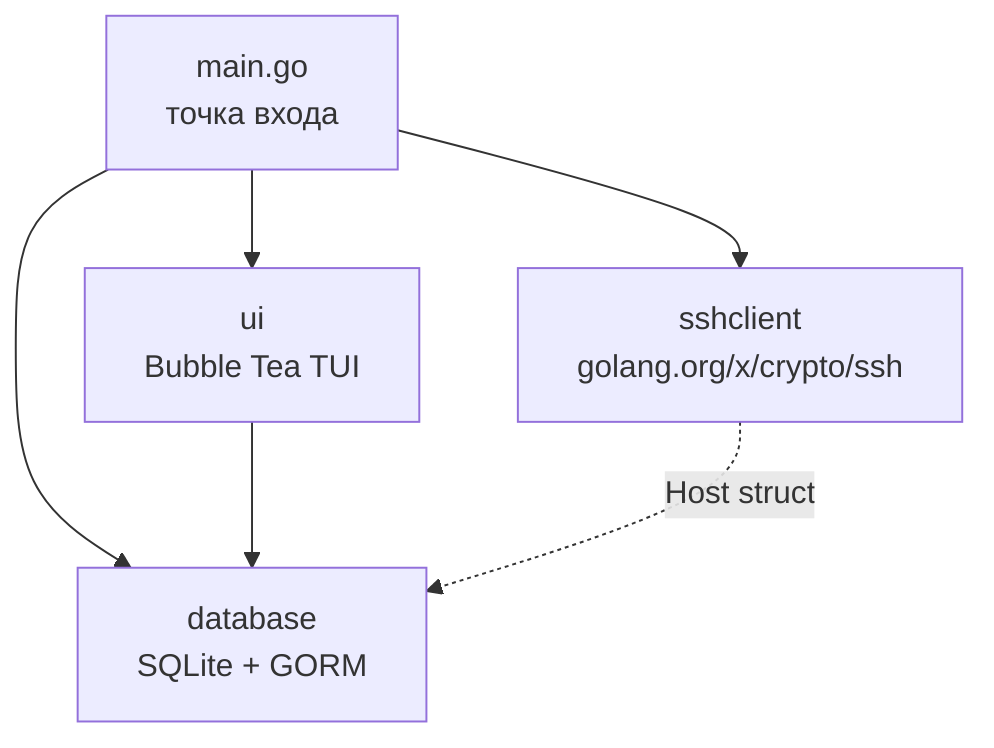
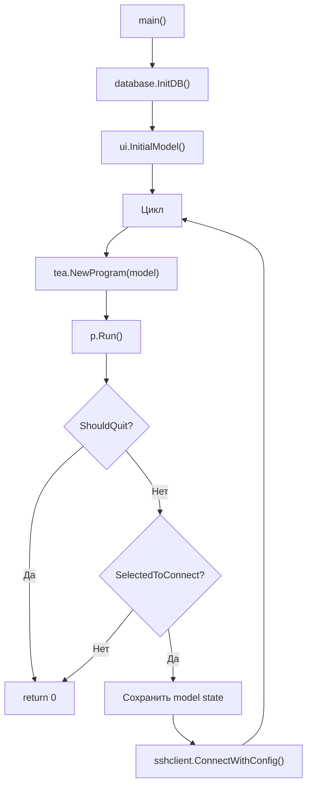
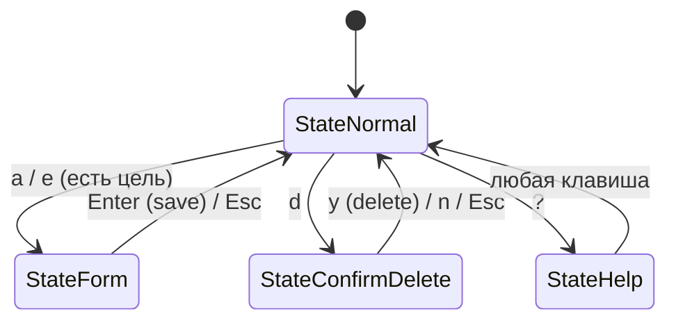
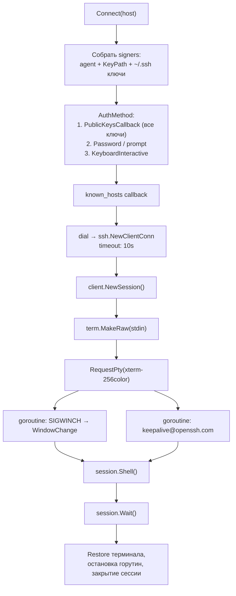

# Архитектура

Документация по внутреннему устройству MakoTerm для разработчиков.

## Обзор

MakoTerm — однобинарное TUI-приложение, состоящее из четырёх пакетов:



| Пакет | Путь | Назначение |
|-------|------|------------|
| `main` | `main.go` | Точка входа, цикл приложения, ожидание Enter после SSH |
| `database` | `database/` | Модели данных, SQLite через GORM, миграции |
| `sshclient` | `sshclient/` | SSH-подключение, аутентификация, known_hosts, PTY |
| `ui` | `ui/` | TUI: тема, модель Bubble Tea, компоненты |

## Жизненный цикл приложения

Ключевой паттерн — **exit-and-restart loop**:



### Почему exit-and-restart

Bubble Tea работает в alt screen mode и перехватывает stdin. SSH-сессия тоже требует полный контроль над терминалом. Две системы не могут работать одновременно.

Решение: когда пользователь выбирает хост, Bubble Tea завершается (`tea.Quit`), `main()` запускает SSH-сессию синхронно, а после её завершения создаёт новый `tea.Program` с **тем же** экземпляром `Model`. Это сохраняет позицию курсора, выбранную группу и прочее состояние UI.

Исходный код (`main.go`):

```go
model := ui.InitialModel()
for {
    p := tea.NewProgram(model, tea.WithAltScreen())
    finalModel, _ := p.Run()
    m := finalModel.(ui.Model)
    if m.ShouldQuit || m.SelectedToConnect == nil { return 0 }

    model = m
    model.SelectedToConnect = nil
    sshclient.ConnectWithConfig(host, sshclient.Config{In: prompts.in(), Out: os.Stderr})
    // цикл продолжается — Bubble Tea перезапускается
}
```

Ввод для всех интерактивных вопросов (пароль, принятие host key, «Press Enter»)
идёт через один `bufio.Reader` (`promptReader` в `main.go`). Раньше использовался
`fmt.Scanln`, который читал из `os.Stdin` напрямую и срабатывал мгновенно на
данных, оставшихся после SSH-сессии.

## Bubble Tea: модель и состояния

### Архитектура Elm

```
Init() → начальная Model
         ↓
    ┌─── Update(msg) ←── KeyMsg, WindowSizeMsg
    │         ↓
    │    Model (мутирован)
    │         ↓
    └──→ View() → строка для рендеринга
```

### Состояния (State Machine)



| Состояние | Значение | Описание |
|-----------|----------|----------|
| `StateNormal` | 0 | Навигация по Miller Columns |
| `StateForm` | 1 | Форма добавления/редактирования |
| `StateConfirmDelete` | 2 | Диалог подтверждения удаления |
| `StateHelp` | 3 | Экран справки |

### Обработка ошибок

Ошибки хранятся в поле `err` модели. Если `err != nil`, View() отображает error dialog вместо основного контента. Любая клавиша сбрасывает `err = nil`.

Ошибки возвращаются синхронно из `database` (CRUD-функции) и попадают в `Model.err`
из `reload()`, `updateHosts()` и обработчиков форм. Отдельного типа сообщения для
ошибок нет — он был удалён как неиспользуемый.

### Model

```go
type Model struct {
    miller            MillerColumns    // трёхколоночная навигация
    err               error            // текущая ошибка
    width, height     int              // размер терминала
    SelectedToConnect *database.Host   // хост для подключения (exported → main.go)
    ShouldQuit        bool             // флаг выхода (exported → main.go)
    state             State            // текущее состояние
    form              Form             // форма ввода
    pending           *pendingDelete   // контекст удаления
}
```

Поля `SelectedToConnect` и `ShouldQuit` exported — используются в `main.go` после завершения `p.Run()`.

### Сообщения

| Тип | Источник | Обработка |
|-----|----------|-----------|
| `tea.KeyMsg` | Ввод пользователя | Маршрутизация по state + key |
| `tea.WindowSizeMsg` | Изменение размера терминала | Обновление width/height, miller.Width/Height, `ClampOffsets()` |

### Команды

`Init()` возвращает `nil` — нет асинхронных команд при старте. Единственные `tea.Cmd` генерируются формами (textinput cursor blink) и `tea.Quit` при выходе.

## MillerColumns

Структура для трёхколоночной навигации. **Не является** Bubble Tea Model — это обычный struct с методами `View()` и навигации.

```go
type MillerColumns struct {
    Width, Height   int              // размер, задаётся из Model
    Groups          []database.Group
    Hosts           []database.Host
    ActiveCol       int              // 0: Groups, 1: Hosts
    GroupCursor     int
    HostCursor      int
    GroupOffset     int              // смещение для скроллинга
    HostOffset      int
}
```

### Геометрия (важно)

`miller.Height` — это высота **всего блока колонки**, включая рамку и заголовок,
а не высота списка. Отсюда единственное правило, из которого выводится всё
остальное:

```
высота блока = рамка (2) + заголовок (1) + строки элементов
строки элементов ≤ Height - 3            // listCapacity()
```

Раньше в трёх местах использовались разные формулы, и колонка могла оказаться на
строку-две выше отведённого места, потому что `lipgloss.Height()` — это минимум,
а не максимум. Сейчас:

- `renderListColumn` рендерит ровно `Height` строк;
- длинные имена обрезаются (`ansi.Truncate`) вместо переноса;
- `Model.View()` дополнительно обрезает собранный кадр до `height` строк.

Индикаторы прокрутки `↑`/`↓` занимают строки **внутри** бюджета `Height - 3`, а не
добавляются сверх него.

### Ширина

- Ширина каждой колонки: `(Width - 4) / 3`, минимум `minColWidth` (18)
- Три колонки соединяются через `lipgloss.JoinHorizontal`

### Скроллинг

Смещение окна **выводится** из позиции курсора, а не хранится независимо:

```go
func (m *MillerColumns) ensureVisible() {
    m.GroupOffset = windowStart(m.GroupCursor, len(m.Groups), m.listCapacity(), m.GroupOffset)
    m.HostOffset  = windowStart(m.HostCursor, len(m.Hosts), m.listCapacity(), m.HostOffset)
}
```

`windowStart` держит курсор внутри окна, не даёт окну уйти за конец списка и
сохраняет предыдущее положение, если курсор остаётся видимым. Раньше `MoveUp`
правил `Offset` вручную и при `cursor == offset` условие не выполнялось, поэтому
выделение уезжало за верхнюю границу. `ClampOffsets()` (вызывается на resize)
сводится к `clampCursors()` + `ensureVisible()`.

## Form

Компонент формы для добавления и редактирования.

```go
type Form struct {
    Type        FormType           // GroupAdd/GroupEdit/HostAdd/HostEdit
    TargetGroup *database.Group    // для GroupAdd/HostAdd
    TargetHost  *database.Host     // для HostEdit
    inputs      []textinput.Model  // поля ввода (Bubbles textinput)
    labels      []string           // подписи полей
    focus       int                // индекс активного поля
}
```

### Типы форм

| Тип | Поля |
|-----|------|
| `FormTypeGroupAdd` / `FormTypeGroupEdit` | Name |
| `FormTypeHostAdd` / `FormTypeHostEdit` | Name, Address, Port, User, Password, Key Path |

### Валидация (в методе Save)

- Имя: не может быть пустым
- Адрес: не может быть пустым (только для хостов)
- Порт: число от 1 до 65535

`Form.Update` начинается с проверки `len(f.inputs) == 0`: переход по `Tab`
вычисляет `focus % len(inputs)` и паниковал бы на форме без полей. Обработчики
`a`/`e` в `model.go` не открывают форму без корректной цели.

## SSH-соединение

### Конфигурация

`ConnectWithConfig(host, Config)` принимает внедряемую конфигурацию; `Connect(host)`
— обёртка с нулевым значением (окружение процесса). `Config` описывает ввод/вывод,
домашний каталог, путь к known_hosts, сокет агента, dialer, терминал и логгер. Это
то, что делает пакет тестируемым: в тестах клиент соединяется с SSH-сервером,
поднятым в том же процессе.

### Поток подключения



### Аутентификация

Все подписывающие ключи собираются в один `PublicKeysCallback`. Go's
`x/crypto/ssh` считает каждый элемент `AuthMethod` отдельной попыткой метода
`publickey`: если бы пустой ssh-agent был отдельной попыткой, он «исчерпал» бы
метод и файловые ключи не проверялись бы вовсе.

Зашифрованные ключи: `ssh.ParsePrivateKey` возвращает `*ssh.PassphraseMissingError`,
после чего парольная фраза берётся из `Config.KeyPassphrase`, либо запрашивается у
пользователя, либо (если запрос отключён) ключ пропускается с явной причиной.

### Known hosts

Верификация через `golang.org/x/crypto/ssh/knownhosts`:

1. Ключ совпадает → подключение
2. Ключ изменился → отказ, печатаются отпечатки полученного и известного ключей
3. Хост неизвестен → интерактивный запрос (TOFU), при `yes` ключ добавляется в файл

Запись делается для фактического `host:port` (порт 22 — без скобок, иначе
`[host]:port`), то есть в том же формате, что использует OpenSSH; один файл
`known_hosts` корректно разделяется с системным `ssh`.

### Keepalive

Раз в 30 секунд отправляется запрос `keepalive@openssh.com`. Это защищает сессию
от разрыва на idle-таймаутах NAT и файрволов. Интервал настраивается через
`Config.KeepAlive` (0 отключает).

### Legacy-совместимость

Для поддержки старого оборудования включены алгоритмы:

**Шифры:** aes128-gcm, aes256-gcm, chacha20-poly1305, aes128/192/256-ctr, aes128-cbc, 3des-cbc, aes192-cbc, aes256-cbc

**Key exchange:** curve25519-sha256, ecdh-sha2-nistp256/384/521, diffie-hellman-group14-sha256, diffie-hellman-group14-sha1, diffie-hellman-group1-sha1

**MAC:** hmac-sha2-256-etm, hmac-sha2-256, hmac-sha1, hmac-sha1-96

Списки заданы функциями `ciphers()`, `keyExchanges()`, `macs()` в `manager.go`,
современные алгоритмы идут первыми.

### Логирование

`MAKOTERM_DEBUG` (путь к файлу, либо `1` → `~/.makoterm.log`) включает отладочный
лог: выбранные методы аутентификации, загруженные ключи, результат handshake.
Пароли и парольные фразы в лог не попадают.

## База данных

### Модели

```go
type Group struct {
    ID        uint `gorm:"primarykey"`
    CreatedAt time.Time
    UpdatedAt time.Time

    Name     string
    ParentID *uint           // nil = корневая группа
    Children []Group         // FK: ParentID
    Hosts    []Host          // FK: GroupID
}

type Host struct {
    ID        uint `gorm:"primarykey"`
    CreatedAt time.Time
    UpdatedAt time.Time

    GroupID  *uint
    Name     string
    Address  string
    Port     int
    User     string
    Password string          // plaintext, см. docs/security.md
    KeyPath  string
}

type Setting struct {        // служебные маркеры (например, «демо создано»)
    Key   string `gorm:"primarykey"`
    Value string
}
```

`gorm.DeletedAt` **намеренно отсутствует**: с ним удаление становится «мягким», и
пароль удалённого хоста остаётся в файле. Все удаления выполняются через
`Unscoped()` и сопровождаются `VACUUM`.

### Иерархия групп

Группы образуют дерево через self-referencing foreign key `ParentID`, но UI
использует его **на одном уровне**:

- существует ровно одна корневая группа `Root` (`ParentID = nil`);
- все видимые группы — её дочерние;
- корень **скрыт** из списка: его нельзя ни переименовать, ни удалить
  (`ErrRootGroupProtected`), иначе одно нажатие `d` уничтожало бы всю базу;
- `CreateGroup` сам подставляет `ParentID` корня;
- `ensureRootGroup()` при запуске создаёт корень, если его нет, и «усыновляет»
  осиротевшие группы (чинит базы, повреждённые старой версией).

Поле `ParentID` сохранено, чтобы вложенность можно было добавить без миграции.
Функция `GetGroupChildren` используется тестами.

### Миграции

`InitDB` выполняет фазы строго в этом порядке:

1. `purgeLegacySoftDeletedRows()` — удаляет строки, которые прежние версии лишь
   помечали удалёнными (`deleted_at IS NOT NULL`). Они невидимы для запросов, но
   содержат пароли. О количестве удалённых строк сообщается в stderr.
2. `AutoMigrate` — при этом foreign keys **выключены** (`PRAGMA foreign_keys=OFF`):
   SQLite пересобирает таблицу, чтобы добавить constraint, и отказывается
   копировать строки при включённой проверке. После миграции проверка включается
   обратно. Отключение возможно только при одном соединении в пуле — `InitDB`
   вызывает `SetMaxOpenConns(1)`.
3. Колонки `deleted_at` остаются в старых базах: GORM игнорирует немаппированные
   колонки, а их удаление означало бы пересборку таблицы при каждом запуске.

Миграция идемпотентна — тест `TestInitDB_MigrateIsIdempotent` сравнивает DDL таблиц
до и после повторного запуска.

### Настройки SQLite

DSN: `_busy_timeout=5000&_secure_delete=on`

| Параметр | Зачем |
|----------|-------|
| `busy_timeout` | Второй экземпляр приложения ждёт, а не падает с `database is locked` |
| `secure_delete` | Затирает освободившиеся страницы нулями |
| `SetMaxOpenConns(1)` | PRAGMA действуют на соединение; приложение однопоточное |

### Почему не WAL

Режим журнала — обычный `DELETE`, а не WAL. В режиме WAL предыдущие версии
страниц остаются в растущем файле `-wal` до checkpoint'а, из-за чего **пароль
удалённого хоста продолжал читаться в этом файле**, несмотря на `secure_delete` и
`VACUUM`. Журнал отката, используемый `DELETE`, удаляется по завершении
транзакции, поэтому после `VACUUM` секрет исчезает со всех файлов. Регрессионный
тест — `TestDeleteHost_LeavesNoSecretInAnyFile`.

Права 0600 выставляются на файл БД и на любые журнальные файлы (`-journal`,
`-wal`, `-shm`) до записи данных.

### Демо-данные

Создаются не более одного раза на базу: маркер `demo_seeded` в таблице `settings`.
Прежняя логика проверяла только «есть ли группы», поэтому после удаления всех
групп демо-данные возвращались. Отключаются переменной `MAKOTERM_NO_DEMO`.
Адреса — документационные (RFC 5737), логины обезличены.

### CRUD-функции

| Функция | Описание |
|---------|----------|
| `InitDB(path)` | Открывает/создаёт БД, права, миграция, корень, seed |
| `GetRootGroup()` | Группа с `ParentID IS NULL` |
| `GetRootGroups()` | Дочерние группы корня (видимые в UI), сортировка по имени |
| `GetAllGroups()` | Все группы кроме корня (тесты, диагностика) |
| `GetGroupChildren(id)` | Подгруппы по parentID |
| `GetHostsForGroup(id)` | Хосты группы |
| `CreateGroup(g)` | Создать группу (ParentID подставляется) |
| `UpdateGroup(g)` | Обновить группу; для корня — `ErrRootGroupProtected` |
| `DeleteGroup(g)` | Физическое рекурсивное удаление + `VACUUM` |
| `CreateHost(h)` / `UpdateHost(h)` | Хост |
| `DeleteHost(h)` | Физическое удаление + `VACUUM` |

### Глобальное состояние

`database.DB` — глобальная переменная `*gorm.DB`. Инициализируется один раз в
`main()`. Все функции работают через неё. В тестах подменяется через
`setupTestDB()`.

> Это главный барьер для параллельных тестов и асинхронных `tea.Cmd`. Переход на
> явную передачу `*gorm.DB` — желаемое направление рефакторинга.

## UI: рендеринг

### View() структура

```
renderHeader()    → 1 строка (header bar)
mainView          → height - 2 строк (контент или диалог)
renderFooter()    → 1 строка (footer bar)
```

Соединяются через `lipgloss.JoinVertical`, после чего результат обрезается до
`height` строк. Footer собирается из подсказок, которые помещаются в ширину
терминала (остальные отбрасываются) — иначе на узком экране он переносился на
вторую строку и ломал кадр.

### Тема

Все цвета и стили определены в `ui/theme.go`. Используется палитра Kanagawa:

| Роль | Цвет | Hex |
|------|------|-----|
| Основной текст | FujiWhite | `#DCD7BA` |
| Вторичный текст | OldWhite | `#C8C093` |
| Muted текст | SumiInk4 | `#54546D` |
| Акцент / фокус | CrystalBlue | `#7E9CD8` |
| Тёплые подписи | BoatYellow | `#C0A36E` |
| Ошибки | AutumnRed | `#C34043` |
| Рамки | SumiInk3 | `#363646` |
| Выделение (неактивное) | WaveBlue | `#2D4F67` |
| Фон баров | SumiInk2 | `#2A2A37` |

Стили организованы по категориям: Header/Footer, Columns, Items, Details, Dialogs, Forms, Help, Common.

## Поток данных при типичной операции

```
1. KeyMsg → Model.Update() → m.miller.MoveDown() → ensureVisible()
2. → updateHosts() → database.GetHostsForGroup() → m.miller.UpdateData()
3. → View() → renderListColumn() для каждой колонки → JoinHorizontal
```

Изменения в БД (Save/Delete) выполняются синхронно в `Update()`, после чего
вызывается `reload()` для перечитывания групп и хостов.
