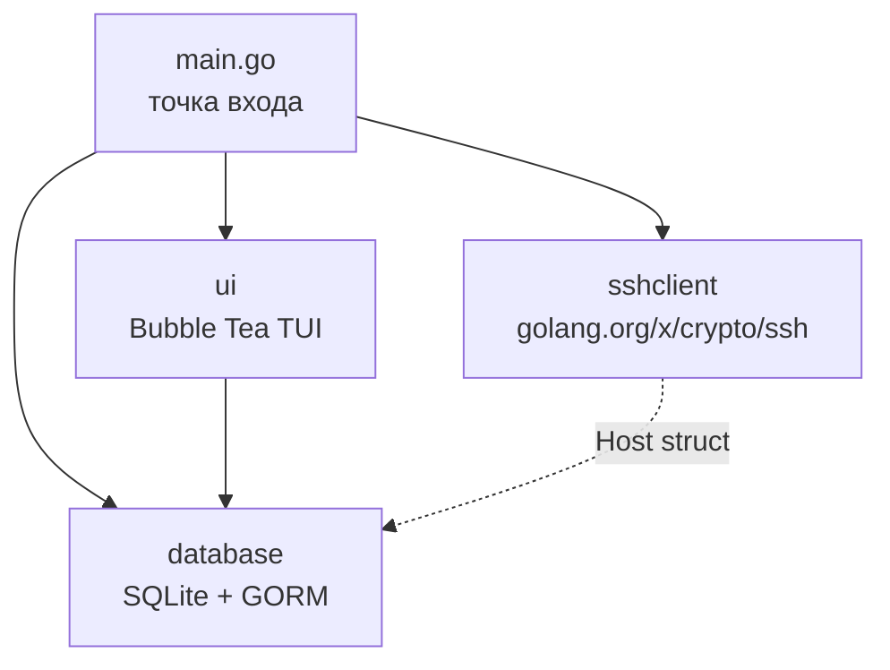
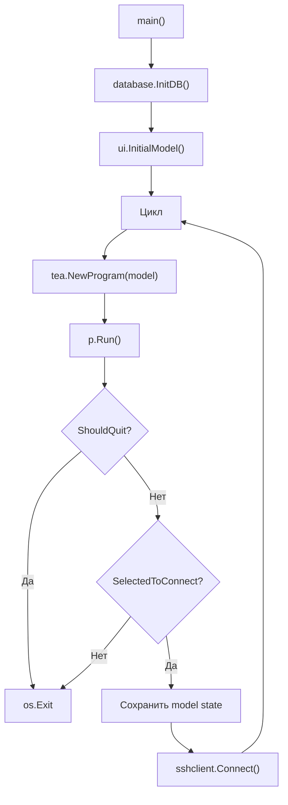
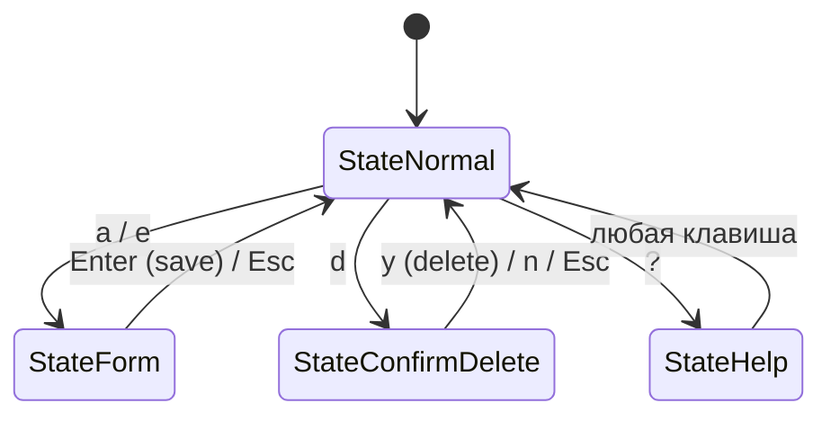
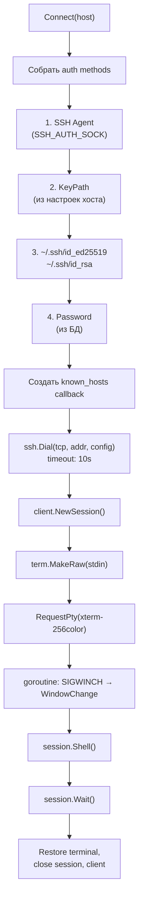

# Архитектура

Документация по внутреннему устройству MakoTerm для разработчиков.

## Обзор

MakoTerm — однобинарное TUI-приложение, состоящее из четырёх пакетов:



| Пакет | Путь | Назначение |
|-------|------|------------|
| `main` | `main.go` | Точка входа, цикл приложения |
| `database` | `database/` | Модели данных, SQLite через GORM |
| `sshclient` | `sshclient/` | SSH-подключение, аутентификация, PTY |
| `ui` | `ui/` | TUI: тема, модель Bubble Tea, компоненты |

## Жизненный цикл приложения

Ключевой паттерн — **exit-and-restart loop**:



### Почему exit-and-restart

Bubble Tea работает в alt screen mode и перехватывает stdin. SSH-сессия тоже требует полный контроль над терминалом. Две системы не могут работать одновременно.

Решение: когда пользователь выбирает хост, Bubble Tea завершается (`tea.Quit`), `main()` запускает SSH-сессию синхронно, а после её завершения создаёт новый `tea.Program` с **тем же** экземпляром `Model`. Это сохраняет позицию курсора, выбранную группу и прочее состояние UI.

Исходный код (`main.go`, строки 23–56):

```go
model := ui.InitialModel()
for {
    p := tea.NewProgram(model, tea.WithAltScreen())
    finalModel, _ := p.Run()
    m := finalModel.(ui.Model)
    if m.ShouldQuit { break }
    if m.SelectedToConnect != nil {
        model = m
        model.SelectedToConnect = nil
        sshclient.Connect(*m.SelectedToConnect)
        // цикл продолжается — Bubble Tea перезапускается
    } else { break }
}
```

## Bubble Tea: модель и состояния

### Архитектура Elm

Bubble Tea реализует Elm Architecture:

```
Init() → начальная Model
         ↓
    ┌─── Update(msg) ←── KeyMsg, WindowSizeMsg, errMsg
    │         ↓
    │    Model (мутирован)
    │         ↓
    └──→ View() → строка для рендеринга
```

### Состояния (State Machine)



| Состояние | Значение | Описание |
|-----------|----------|----------|
| `StateNormal` | 0 | Навигация по Miller Columns |
| `StateForm` | 1 | Форма добавления/редактирования |
| `StateConfirmDelete` | 2 | Диалог подтверждения удаления |
| `StateHelp` | 3 | Экран справки |

### Обработка ошибок

Ошибки хранятся в поле `err` модели. Если `err != nil`, View() отображает error dialog вместо основного контента. Любая клавиша сбрасывает `err = nil`.

### Model

```go
type Model struct {
    miller            MillerColumns    // трёхколоночная навигация
    err               error            // текущая ошибка
    width, height     int              // размер терминала
    SelectedToConnect *database.Host   // хост для подключения (exported → main.go)
    ShouldQuit        bool             // флаг выхода (exported → main.go)
    state             State            // текущее состояние
    form              Form             // форма ввода
    pending           *pendingDelete   // контекст удаления
}
```

Поля `SelectedToConnect` и `ShouldQuit` exported — используются в `main.go` после завершения `p.Run()`.

### Messages

| Тип | Источник | Обработка |
|-----|----------|-----------|
| `tea.KeyMsg` | Ввод пользователя | Маршрутизация по state + key |
| `tea.WindowSizeMsg` | Изменение размера терминала | Обновление width/height, miller.Width/Height |
| `errMsg` | (не используется активно) | Присваивается m.err |

### Commands

`Init()` возвращает `nil` — нет асинхронных команд при старте. Единственные `tea.Cmd` генерируются формами (textinput cursor blink).

## MillerColumns

Структура для трёхколоночной навигации. **Не является** Bubble Tea Model — это обычный struct с методами `View()` и навигации.

```go
type MillerColumns struct {
    Width, Height   int              // размер, задаётся из Model
    Groups          []database.Group
    Hosts           []database.Host
    ActiveCol       int              // 0: Groups, 1: Hosts
    GroupCursor     int
    HostCursor      int
    GroupOffset     int              // смещение для скроллинга
    HostOffset      int
}
```

### Расчёт layout

- Ширина каждой колонки: `(Width - 4) / 3`
- Видимая высота для элементов: `Height - 3` (рамка: 2, заголовок колонки: 1)
- Три колонки соединяются через `lipgloss.JoinHorizontal`

### Скроллинг

При перемещении курсора за пределы видимой области `Offset` сдвигается. При изменении размера терминала `ClampOffsets()` гарантирует корректность.

## Form

Компонент формы для добавления и редактирования.

```go
type Form struct {
    Type        FormType           // GroupAdd/GroupEdit/HostAdd/HostEdit
    TargetGroup *database.Group    // для GroupEdit
    TargetHost  *database.Host     // для HostEdit
    inputs      []textinput.Model  // поля ввода (Bubbles textinput)
    labels      []string           // подписи полей
    focus       int                // индекс активного поля
}
```

### Типы форм

| Тип | Поля |
|-----|------|
| `FormTypeGroupAdd` / `FormTypeGroupEdit` | Name |
| `FormTypeHostAdd` / `FormTypeHostEdit` | Name, Address, Port, User, Password, Key Path |

### Валидация (в методе Save)

- Имя: не может быть пустым
- Адрес: не может быть пустым (только для хостов)
- Порт: число от 1 до 65535

## SSH-соединение

### Поток подключения



### Known hosts

Верификация через `golang.org/x/crypto/ssh/knownhosts`:

1. Ключ совпадает → подключение
2. Ключ изменился → отказ с предупреждением `REMOTE HOST IDENTIFICATION HAS CHANGED`
3. Хост неизвестен → интерактивный запрос (TOFU), при `yes` ключ добавляется в файл

### Legacy-совместимость

Для поддержки старого оборудования включены алгоритмы:

**Шифры:** aes128-gcm, aes256-gcm, chacha20-poly1305, aes128/192/256-ctr, aes128-cbc, 3des-cbc, aes192-cbc, aes256-cbc

**Key exchange:** curve25519-sha256, ecdh-sha2-nistp256/384/521, diffie-hellman-group14-sha256, diffie-hellman-group14-sha1, diffie-hellman-group1-sha1

**MAC:** hmac-sha2-256-etm, hmac-sha2-256, hmac-sha1, hmac-sha1-96

## База данных

### Модели

```go
type Group struct {
    gorm.Model              // ID, CreatedAt, UpdatedAt, DeletedAt
    Name     string
    ParentID *uint           // nil = корневая группа
    Children []Group         // FK: ParentID
    Hosts    []Host          // FK: GroupID
}

type Host struct {
    gorm.Model
    GroupID  *uint
    Name     string
    Address  string
    Port     int
    User     string
    Password string
    KeyPath  string
}
```

### Иерархия групп

Группы образуют дерево через self-referencing foreign key `ParentID`:

- Корневая группа **Root** имеет `ParentID = nil`
- Дочерние группы ссылаются на Root через `ParentID`
- UI показывает дочерние группы Root (не саму Root)

### CRUD-функции

| Функция | Описание |
|---------|----------|
| `InitDB(path)` | Открывает/создаёт БД, миграция, seed данные |
| `GetRootGroup()` | Группа с `ParentID IS NULL` |
| `GetRootGroups()` | Дочерние группы Root (видимые в UI) |
| `GetGroupChildren(id)` | Подгруппы по parentID |
| `GetHostsForGroup(id)` | Хосты группы |
| `CreateGroup(g)` | Создать группу |
| `UpdateGroup(g)` | Обновить группу |
| `DeleteGroup(g)` | Рекурсивное удаление (хосты → подгруппы → группа) |
| `CreateHost(h)` | Создать хост |
| `UpdateHost(h)` | Обновить хост |
| `DeleteHost(h)` | Удалить хост |

### Глобальное состояние

`database.DB` — глобальная переменная `*gorm.DB`. Инициализируется один раз в `main()`. Все функции работают через неё. В тестах подменяется через `setupTestDB()`.

## UI: рендеринг

### View() структура

```
renderHeader()    → 1 строка (header bar)
mainView          → height - 2 строк (контент)
renderFooter()    → 1 строка (footer bar)
```

Соединяются через `lipgloss.JoinVertical`.

### Тема

Все цвета и стили определены в `ui/theme.go`. Используется палитра Kanagawa:

| Роль | Цвет | Hex |
|------|------|-----|
| Основной текст | FujiWhite | `#DCD7BA` |
| Вторичный текст | OldWhite | `#C8C093` |
| Muted текст | SumiInk4 | `#54546D` |
| Акцент / фокус | CrystalBlue | `#7E9CD8` |
| Тёплые подписи | BoatYellow | `#C0A36E` |
| Ошибки | AutumnRed | `#C34043` |
| Рамки | SumiInk3 | `#363646` |
| Выделение (неактивное) | WaveBlue | `#2D4F67` |
| Фон баров | SumiInk2 | `#2A2A37` |

Стили организованы по категориям: Header/Footer, Columns, Items, Details, Dialogs, Forms, Help, Common.
